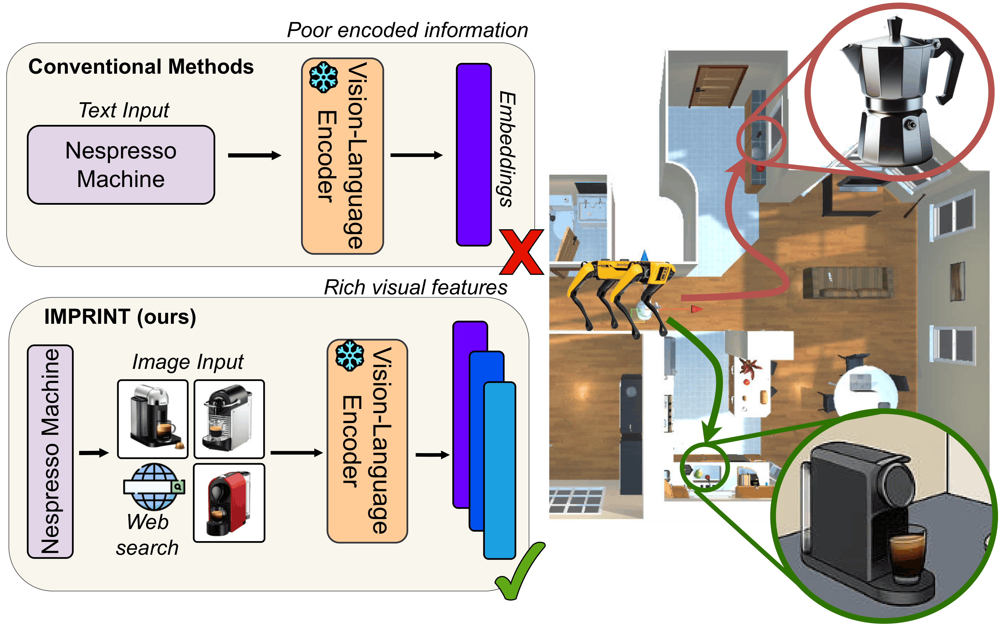

# (IROS'26) IMPRINT: Image-Conditioned Query Enrichment for Long-Tail Object Goal Navigation

This repository will host the **code** and **dataset** for the paper:

IMPRINT: Image-Conditioned Query Enrichment for Long-Tail Object Goal Navigation

---

## 📄 Paper
- [arXiv preprint]()  

<p align="center">
  
</p>

---

## 📢 Updates 
- The dataset and code will be released soon. Stay tuned! 🚀  
- Please consider starring ⭐ this repository to receive the latest updates.

---

<!-- ## HSSD-rare Dataset

For information about the HSSD-rare dataset, please look into the `dataset` directory. -->

<!-- ## Evaluating Baselines -->

 

<!-- ## 📑 Citation
If you find this work useful, please cite: -->

<!-- ```bibtex
@article{ziliotto2025personal,
  title   = {PersONAL: Towards a Comprehensive Benchmark for Personalized Embodied Agents},
  author  = {Filippo Ziliotto and Jelin Raphael Akkara and Alessandro Daniele and Lamberto Ballan and Luciano Serafini and Tommaso Campari},
  journal = {arXiv preprint arXiv:2509.19843},
  year    = {2025}
} -->