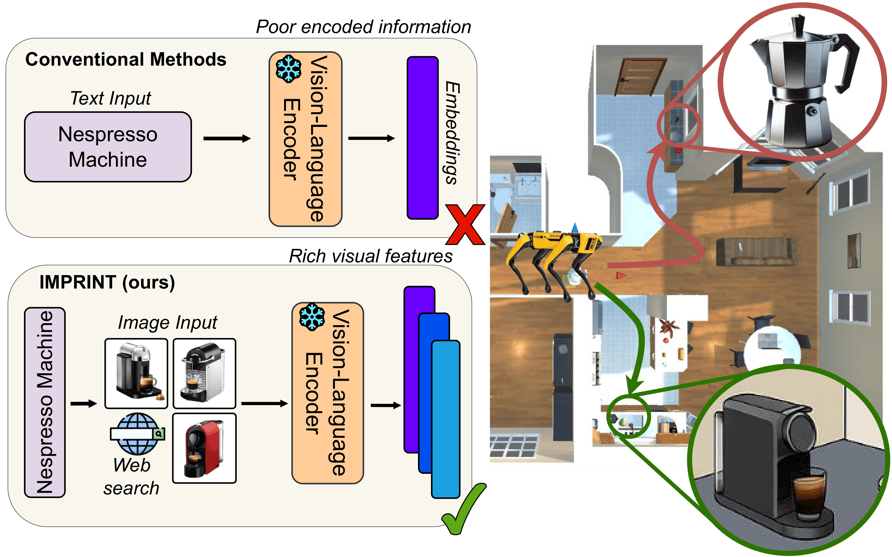

# IMPRINT: Image-Conditioned Query Enrichment for Long-Tail Object Goal Navigation

Published at **IROS 2026**.

**[Project page](https://jelinr.github.io/IMPRINT/)** · **[Paper](https://arxiv.org/abs/2607.25106)** 

Long-tail object goal navigation is difficult because a text query may not capture
the visual variation of rare or unfamiliar objects. IMPRINT addresses this by
retrieving representative images from the web and using them to enrich the query
used for target grounding. It is a zero-shot, plug-and-play approach: the existing
vision-language model and navigation policy remain unchanged.

<p align="center">
  
</p>


<!-- ## HSSD-rare Dataset

For information about the HSSD-rare dataset, please look into the `dataset` directory. -->

<!-- ## Evaluating Baselines -->

## Setting up HSSD-rare Dataset

To generate the HSSD-rare dataset, please refer to the `dataset` directory. This section concerns integrating the already generated dataset into the Habitat pipeline.

To set up HSSD-rare as a dataset in Habitat, start by cloning the repositories. Below, we install Habitat version 0.2.5 (used by baselines such as VLFM and OneMap) into the directory `habitat-labs/v0.2.5`. For using Habitat's older versions, please follow the same procedure as below. For example, Habitat version challenge-2022 is used by the baseline ZSON, and can be installed into the directory `habitat-labs/challenge-2022`.

```bash
#Clone IMPRINT
git clone https://github.com/JelinR/IMPRINT
cd IMPRINT

#Clone Habitat-Lab
mkdir -p ./habitat-labs/v0.2.5
cd ./habitat-labs/v0.2.5
git clone --branch v0.2.5 https://github.com/facebookresearch/habitat-lab
cd ..
cd ..
```

#### Download HSSD-Hab data

```bash

#----- Download the HSSD scene datasets --------
python -m habitat_sim.utils.datasets_download \
  --uids hssd-hab --data-path habitat-lab/data
```

#### Symlink to HSSD-rare episodes

Now that we have the scene data, we assign the HSSD-rare episodes from the habitat-utils.

```bash
#Create directory in habitat-lab
mkdir -p habitat-labs/v0.2.5/habitat-lab/data/datasets/objectnav/hssd/val_rare/content/

#Create symlink
ln -s dataset/hssd_rare_eps  habitat-labs/v0.2.5/habitat-lab/data/datasets/objectnav/hssd/val_rare/content/
```

## Setting up OVON Dataset

Please refer to the [source directory](https://github.com/naokiyokoyama/ovon) to set up HM3D scene dataset and the desired OVON dataset.

## Testing Baselines

To test baselines, please look up the `baselines` directory, which contains instructions on setting up the environments, and running the evaluation.


---

## 📑 Citation
If you find this work useful, please cite:

```bibtex
@article{akkara2026imprint,
  title   = {IMPRINT: Image-Conditioned Query Enrichment
             for Long-Tail Object Goal Navigation},
  author  = {Akkara, Jelin Raphael and Ziliotto, Filippo and
             Serafini, Luciano and Ballan, Lamberto and Campari, Tommaso},
  journal = {arXiv preprint arXiv:2607.25106},
  year    = {2026}
}
